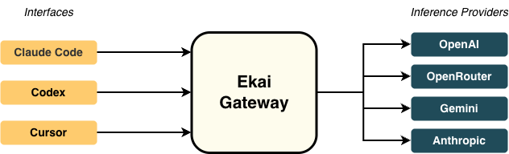

# Architecture Overview

The Ekai Gateway is a self-hosted multi-provider API layer with built-in usage analytics.\
It exposes OpenAI- and Anthropic-compatible endpoints, routes requests to multiple providers, and records usage and cost in a local SQLite database.

<figure><figcaption></figcaption></figure>

## System Components

### Gateway API (port 3001)

Handles incoming LLM requests from any OpenAI- or Anthropic-compatible client.\
It normalizes payloads, selects a provider, and forwards the request using your API keys.\
Endpoints include `/v1/chat/completions`, `/v1/messages`, `/usage`, and `/health`.

### Provider Router

Resolves which provider to use for each model.\
The router supports OpenAI, Anthropic, xAI (Grok), and OpenRouter.\
It can automatically fall back to another provider if one fails and can prioritize the cheapest option.

### Dashboard UI (port 3000)

A web dashboard that visualizes request volume, token usage, and cost per provider.\
It connects to the SQLite database populated by the gateway.

### Storage

Usage data and request logs are stored in a local SQLite database (by default `data/usage.db`).\
No external database configuration is required.

***

## Multi-Provider Routing Logic

1. A client sends a request using the OpenAI or Anthropic API format.
2. The Gateway parses the model name (for example `gpt-4o` or `claude-3-opus`).
3. The router checks which providers can serve that model.
4. It chooses the cheapest available provider based on pricing data.
5. If a request fails, it falls back to another provider.
6. The Gateway records token counts, provider name, and cost for dashboard analytics.

This routing allows developers to use the best model for each task without changing client configuration.

***

## Supported API Formats

### OpenAI-Compatible API

* Endpoint: `/v1/chat/completions`
* Works with existing OpenAI SDKs or clients like Codex.
* Supports models such as `gpt-4o`, `gpt-3.5-turbo`, and any OpenRouter model using `provider/model`.

### Anthropic-Compatible API

* Endpoint: `/v1/messages`
* Fully compatible with Claude Code and other Anthropic clients.
* Supports models such as `claude-3-opus`, `claude-3-sonnet`, and `claude-3-haiku`.

Both formats can be used simultaneously; the Gateway automatically normalizes requests and responses.

***

## Architecture Diagram

```
Client (Claude Code / Codex / Custom App)
        │
        │  OpenAI or Anthropic request
        ▼
Gateway API  (localhost:3001)
  - Validate and normalize payload
  - Resolve model → provider mapping
  - Apply cost-optimized routing + fallback
  - Record usage to SQLite
        │
        ▼
Provider API (OpenAI / Anthropic / xAI / OpenRouter)
        │
        ▼
Dashboard UI  (localhost:3000)
  - Read from SQLite
  - Display token usage, cost, and provider statistics
```

The Gateway acts as a neutral interface between clients and providers, enabling model switching, transparency, and complete data ownership.
