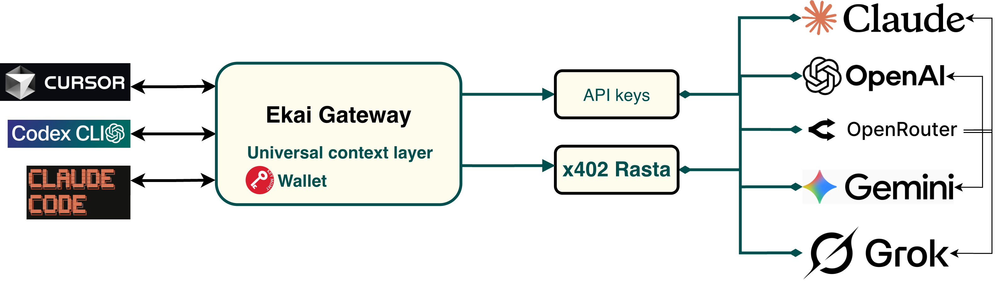
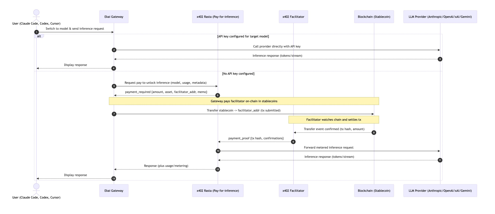

# Architecture Overview

The Ekai Gateway is a self-hosted multi-provider API layer with built-in usage analytics.\
It exposes OpenAI- and Anthropic-compatible endpoints, routes requests to multiple providers, and records usage and cost in a local SQLite database.

It also supports x402 pay-for-inference: when a model lacks a API key, the gateway can route via x402 Rasta, settle fees on-chain in stablecoins, and relay the response from the appropriate provider.

<figure><figcaption></figcaption></figure>

## System Components

### Gateway API (port 3001)

Handles incoming LLM requests from any OpenAI- or Anthropic-compatible client.\
It normalizes payloads, selects a provider, and forwards the request using your API keys.\
Endpoints include `/v1/chat/completions`, `/v1/messages`, `/usage`, and `/health`.

### Provider Router

Resolves which provider to use for each model.\
The router supports OpenAI, Anthropic, Google (Gemini), xAI (Grok), and OpenRouter.\
It can automatically fall back to another provider if one fails and can prioritize the cheapest option.

### x402 Integration

Provides a pay-to-unlock path when API credentials are unavailable.\
Returns payment parameters, settles fees on-chain to the x402 facilitator, and forwards requests to the correct provider once confirmed.

### Dashboard UI (port 3000)

A web dashboard that visualizes request volume, token usage, and cost per provider.\
It connects to the SQLite database populated by the gateway.

### Storage

Usage data and request logs are stored in a local SQLite database (by default `data/usage.db`).\
No external database configuration is required.

***

## Multi-Provider Routing Logic

1. A client sends a request using the OpenAI or Anthropic API format.
2. The Gateway parses the model name (for example `gpt-4o` or `claude-3-opus`).
3. The router checks which providers can serve that model.
4. It chooses the cheapest available provider based on pricing data.
5. If a request fails, it falls back to another provider.
6. The Gateway records token counts, provider name, and cost for dashboard analytics.

This routing allows developers to use the best model for each task without changing client configuration.

***

## Supported API Formats

### OpenAI-Compatible API

* Endpoint: `/v1/chat/completions`
* Works with existing OpenAI SDKs or clients like Codex.
* Supports models such as `gpt-4o`, `gpt-3.5-turbo`, and any OpenRouter model using `provider/model`.

### Anthropic-Compatible API

* Endpoint: `/v1/messages`
* Fully compatible with Claude Code and other Anthropic clients.
* Supports models such as `claude-3-opus`, `claude-3-sonnet`, and `claude-3-haiku`.

Both formats can be used simultaneously; the Gateway automatically normalizes requests and responses.

***

## Architecture Diagram

<figure>
  
  <figcaption>High-level components and request/response flow with x402.</figcaption>
  </figure>

The Gateway acts as a neutral interface between clients and providers, enabling model switching, transparency, and complete data ownership.

### How x402 Works

1. Clients (Claude Code, Codex, Cursor) can select any target model through the gateway.
2. When a requested model lacks a configured API credential, the gateway escalates the request to x402 Rasta.
3. x402 Rasta returns the payment parameters required to authorize processing.
4. The gateway settles the fee on-chain in stablecoins to the designated x402 facilitator address.
5. Upon confirmation, x402 Rasta relays the request to the corresponding LLM inference provider.
6. The provider’s result flows back via x402 Rasta to the gateway, which streams the response to the client.

#### More Details

<figure>
  
  <figcaption>x402 pay-for-inference sequence (steps 1–13).</figcaption>
</figure>

- Direct-call path: If a valid API key exists, the gateway calls the provider directly and streams the response back (steps 2–3).
- Pay-to-unlock trigger: When no API key is configured, the gateway requests pay-to-unlock from x402 Rasta and receives `payment_required { amount, asset, facilitator_addr, memo }` (steps 5–6).
- On-chain settlement: The gateway transfers stablecoins to the facilitator; the facilitator monitors the chain and confirms the transfer (tx hash, amount, confirmations) (steps 7–9).
- Provider relay: After confirmation, the facilitator forwards the metered inference request to the appropriate LLM provider and receives the response (tokens/stream) (steps 10–11).
- Response return: x402 Rasta returns the result to the gateway, which streams it to the client UI (steps 12–13).
