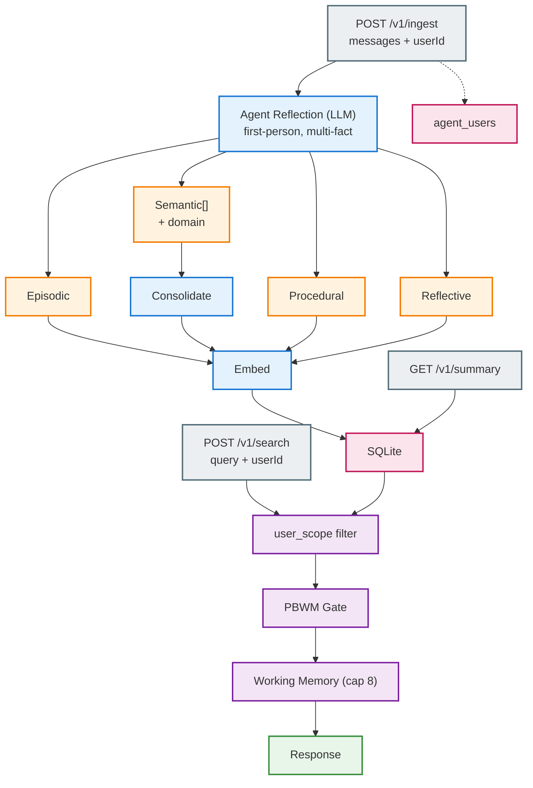
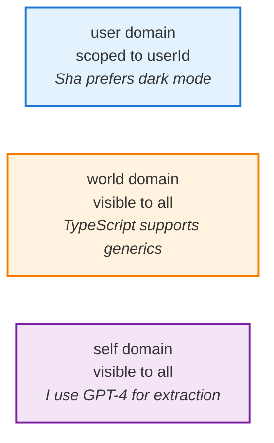

# Memory Service (Ekai)

Neuroscience-inspired, agent-centric memory kernel. Sectorized storage with PBWM gating — the agent reflects on conversations and decides what to learn. Memory is first-person, not a passive database about users.

## Quickstart

```bash
npm install -w memory
npm run build -w memory
npm start -w memory          # :4005
```

Env (root `.env` or `memory/.env`):

| Variable | Default | Required |
|----------|---------|----------|
| `GOOGLE_API_KEY` | — | Yes |
| `GEMINI_EXTRACT_MODEL` | `gemini-2.5-flash` | No |
| `GEMINI_EMBED_MODEL` | `gemini-embedding-001` | No |
| `MEMORY_PORT` | `4005` | No |
| `MEMORY_DB_PATH` | `./memory.db` | No |
| `MEMORY_CORS_ORIGIN` | `*` | No |

## How It Works



### Four Sectors

| Sector | What it stores | Example |
|--------|---------------|---------|
| **Episodic** | Events, conversations | "I discussed architecture with Sha on Monday" |
| **Semantic** | Facts as triples + domain | `Sha / prefers / dark mode` (domain: `user`) |
| **Procedural** | Multi-step workflows | When deploying: test -> build -> push |
| **Reflective** | Agent self-observations | "I tend to overcomplicate solutions" |

### Domain & User Scoping



When `userId` is passed: `user`-domain facts are only visible to that user. `world`/`self` facts are shared.

### Attribution

Every memory tracks its origin: `origin_type` (conversation/document/api), `origin_actor` (who), `origin_ref` (source reference).

### Consolidation

Semantic triples go through consolidation per triple:
- **Merge** — same fact exists -> strengthen it
- **Supersede** — different value for same slot -> close old, insert new
- **Insert** — new fact

Predicate matching uses embeddings (>=0.9 cosine): "cofounded" ~ "is co-founder of" -> same slot.

## API

### `POST /v1/ingest`

Ingest a conversation. Full conversation (user + assistant) goes to the LLM for agent-centric reflection.

```json
{
  "messages": [
    { "role": "user", "content": "I prefer dark mode and use TypeScript" },
    { "role": "assistant", "content": "Noted!" }
  ],
  "profile": "my-agent",
  "userId": "sha"
}
```
```json
{ "stored": 3, "ids": ["...", "...", "..."], "profile": "my-agent" }
```

### `POST /v1/search`

Search with PBWM gating. Pass `userId` for user-scoped retrieval.

```json
{ "query": "what does Sha prefer?", "profile": "my-agent", "userId": "sha" }
```
```json
{
  "workingMemory": [
    { "sector": "semantic", "content": "Sha prefers dark mode", "score": 0.87, "details": { "subject": "Sha", "predicate": "prefers", "object": "dark mode", "domain": "user" } }
  ],
  "perSector": { "episodic": [], "semantic": [...], "procedural": [], "reflective": [] },
  "profileId": "my-agent"
}
```

### `GET /v1/summary`

Per-sector counts + recent memories.

```
GET /v1/summary?profile=my-agent&limit=20
```
```json
{
  "summary": [
    { "sector": "episodic", "count": 3, "lastCreatedAt": 1700000000 },
    { "sector": "semantic", "count": 12, "lastCreatedAt": 1700100000 },
    { "sector": "procedural", "count": 1, "lastCreatedAt": 1700050000 },
    { "sector": "reflective", "count": 2, "lastCreatedAt": 1700090000 }
  ],
  "recent": [{ "id": "...", "sector": "semantic", "preview": "dark mode", "details": {...} }],
  "profile": "my-agent"
}
```

### `POST /v1/ingest/documents`

Ingest markdown files from a directory with deduplication.

```json
{ "path": "/path/to/docs", "profile": "project-x" }
```

### `GET /v1/users`

List all users the agent has interacted with.

```
GET /v1/users?profile=my-agent
```
```json
{
  "users": [{ "userId": "sha", "firstSeen": 1700000000, "lastSeen": 1700100000, "interactionCount": 5 }]
}
```

### `GET /v1/users/:id/memories`

Get all memories scoped to a specific user.

### All Endpoints

| Method | Endpoint | Description |
|--------|----------|-------------|
| POST | `/v1/ingest` | Ingest conversation |
| POST | `/v1/ingest/documents` | Ingest markdown directory |
| POST | `/v1/search` | Search with PBWM gating |
| GET | `/v1/summary` | Sector counts + recent |
| GET | `/v1/users` | List agent's users |
| GET | `/v1/users/:id/memories` | User-scoped memories |
| GET | `/v1/profiles` | List profiles |
| PUT | `/v1/memory/:id` | Update a memory |
| DELETE | `/v1/memory/:id` | Delete one memory |
| DELETE | `/v1/memory` | Delete all for profile |
| DELETE | `/v1/profiles/:slug` | Delete profile + memories |
| GET | `/v1/graph/triples` | Query semantic triples |
| GET | `/v1/graph/neighbors` | Entity neighbors |
| GET | `/v1/graph/paths` | Paths between entities |
| GET | `/v1/graph/visualization` | Graph visualization data |
| DELETE | `/v1/graph/triple/:id` | Delete a triple |
| GET | `/health` | Health check |

All endpoints support `profile` query/body param.

## Retrieval Pipeline


Sector weights: episodic `1.0`, semantic `1.0`, procedural `1.0`, reflective `0.8`.

## Data Model

```mermaid
erDiagram
    profiles ||--o{ memory : has
    profiles ||--o{ semantic_memory : has
    profiles ||--o{ procedural_memory : has
    profiles ||--o{ reflective_memory : has
    profiles ||--o{ agent_users : has

    memory { text id PK; text sector; text content; text user_scope; text origin_type }
    semantic_memory { text id PK; text subject; text predicate; text object; text domain; text user_scope; real strength }
    procedural_memory { text id PK; text trigger; json steps; text user_scope; text origin_type }
    reflective_memory { text id PK; text observation; text origin_type; text origin_actor }
    agent_users { text agent_id PK; text user_id PK; int interaction_count }
    profiles { text slug PK; int created_at }
```

All tables share: `embedding`, `created_at`, `last_accessed`, `profile_id`, `source`, `origin_type`, `origin_actor`, `origin_ref`. Schema auto-upgrades on startup.

## Integration

When used via `@ekai/openrouter`, memories are injected as:

```
<memory>
What I know:
- Sha prefers dark mode

What I remember:
- I discussed architecture with Sha on Monday

How I do things:
- When deploying: test -> build -> push

My observations:
- Sha responds better when I lead with the conclusion
</memory>
```

## Notes

- Supports Gemini and OpenAI-compatible APIs for extraction/embedding
- `user_scope` is opt-in — no `userId` = all memories returned
- Schema migrations are additive — existing DBs auto-upgrade, no manual steps
- Reflective weight `0.8` is a tuning knob
