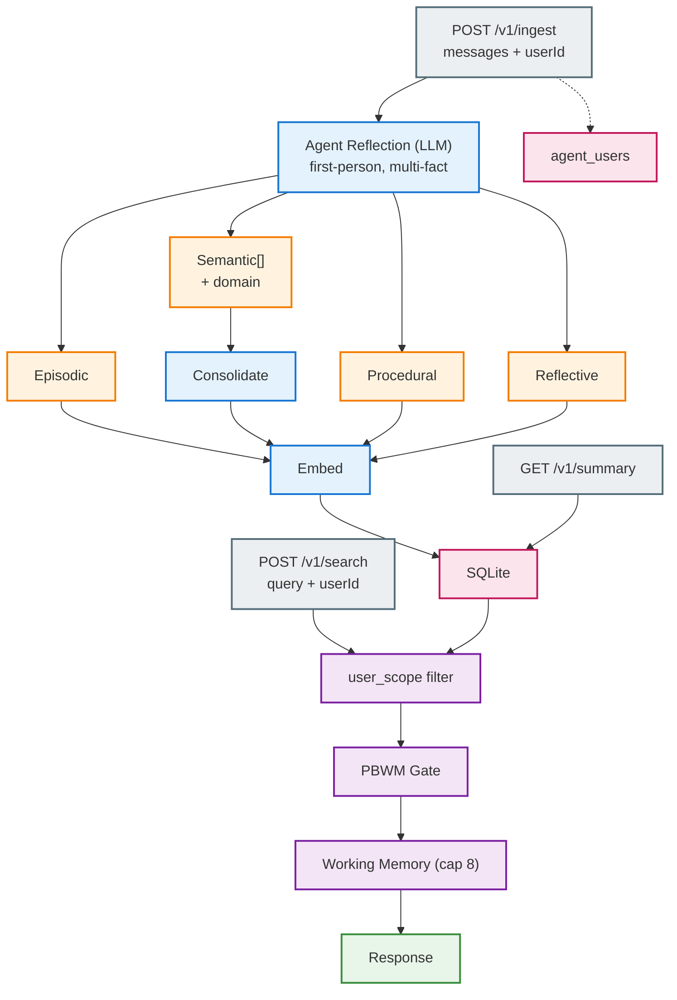
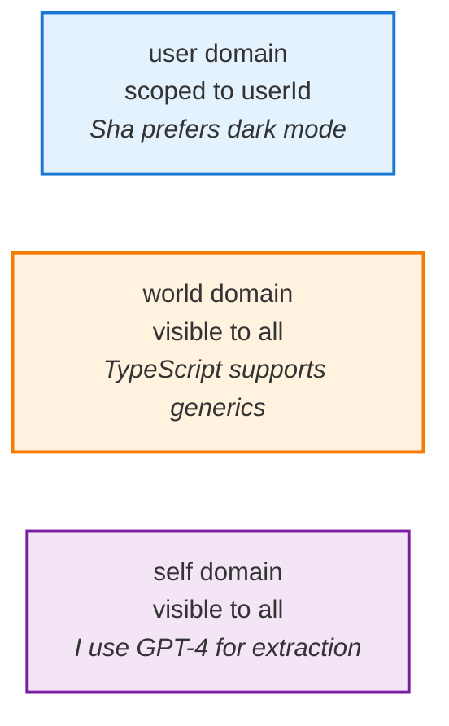
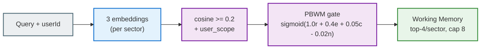

# Memory SDK (Ekai)

Neuroscience-inspired, agent-centric memory kernel. Sectorized storage with PBWM gating — the agent reflects on conversations and decides what to learn. Memory is first-person, not a passive database about users.

## Quickstart

By default, memory is embedded inside the OpenRouter integration and served on port `4010`. No separate service needed.

```bash
npm install -w @ekai/memory
npm run build -w @ekai/memory
```

See [Usage Modes](#usage-modes) below for SDK, mountable router, and standalone options.

### SDK Usage

```ts
import { Memory } from '@ekai/memory';

// Provider config is global — shared across all agents
const mem = new Memory({ provider: 'openai', apiKey: 'sk-...' });

// Register an agent (soul is optional)
mem.addAgent('my-bot', { name: 'My Bot', soul: 'You are helpful' });

// Get a scoped instance — all data ops go through this
const bot = mem.agent('my-bot');
await bot.add(messages, { userId: 'alice' });
await bot.search('preferences', { userId: 'alice' });
bot.users();                            // agent's known users
bot.memories();                         // all agent memories
bot.memories({ userId: 'alice' });      // memories about alice
bot.memories({ scope: 'global' });      // non-user-scoped memories
bot.delete(id);
```

### Environment Variables

| Variable | Default | Required |
|----------|---------|----------|
| `GOOGLE_API_KEY` | — | Yes (if using Gemini provider) |
| `OPENAI_API_KEY` | — | Yes (if using OpenAI provider) |
| `OPENROUTER_API_KEY` | — | Yes (if using OpenRouter provider) |
| `MEMORY_EMBED_PROVIDER` | `gemini` | No |
| `MEMORY_EXTRACT_PROVIDER` | `gemini` | No |
| `MEMORY_DB_PATH` | `./memory.db` | No |
| `MEMORY_CORS_ORIGIN` | `*` | No (standalone mode only) |

## Usage Modes

### 1. SDK (recommended)

```ts
import { Memory } from '@ekai/memory';

// Provider config is global
const mem = new Memory({ provider: 'openai', apiKey: 'sk-...' });

// Register agents (soul is optional)
mem.addAgent('my-bot', { name: 'My Bot', soul: 'You are helpful' });
mem.addAgent('support-bot', { name: 'Support Bot' });
mem.getAgents();

// Scope to an agent for data ops
const bot = mem.agent('my-bot');
await bot.add(messages, { userId: 'alice' });
await bot.search('query', { userId: 'alice' });
bot.users();
bot.memories({ userId: 'alice' });
bot.delete(id);
```

### 2. Mountable router

Mount memory endpoints into an existing Express app:

```ts
import { Memory, createMemoryRouter } from '@ekai/memory';

const memory = new Memory({ provider: 'openai', apiKey: 'sk-...' });
app.use(createMemoryRouter(memory._store, memory._extractFn));
```

This is how the OpenRouter integration embeds memory on port `4010`.

### 3. Standalone server

Run memory as its own HTTP server (useful for development or isolated deployments):

```bash
npm run start -w @ekai/memory
```

## How It Works



### Four Sectors

| Sector | What it stores | Example |
|--------|---------------|---------|
| **Episodic** | Events, conversations | "I discussed architecture with Sha on Monday" |
| **Semantic** | Facts as triples + domain | `Sha / prefers / dark mode` (domain: `user`) |
| **Procedural** | Multi-step workflows | When deploying: test -> build -> push |
| **Reflective** | Agent self-observations | "I tend to overcomplicate solutions" |

### Domain & User Scoping



When `userId` is passed: `user`-domain facts are only visible to that user. `world`/`self` facts are shared.

### Attribution

Every memory tracks its origin: `origin_type` (conversation/document/api), `origin_actor` (who), `origin_ref` (source reference).

### Consolidation

Semantic triples go through consolidation per triple:
- **Merge** — same fact exists -> strengthen it
- **Supersede** — different value for same slot -> close old, insert new
- **Insert** — new fact

Predicate matching uses embeddings (>=0.9 cosine): "cofounded" ~ "is co-founder of" -> same slot.

## API

### `POST /v1/ingest`

Ingest a conversation. Full conversation (user + assistant) goes to the LLM for agent-centric reflection.

```json
{
  "messages": [
    { "role": "user", "content": "I prefer dark mode and use TypeScript" },
    { "role": "assistant", "content": "Noted!" }
  ],
  "agent": "my-bot",
  "userId": "sha"
}
```
```json
{ "stored": 3, "ids": ["...", "...", "..."], "agent": "my-bot" }
```

### `POST /v1/search`

Search with PBWM gating. Pass `userId` for user-scoped retrieval.

```json
{ "query": "what does Sha prefer?", "agent": "my-bot", "userId": "sha" }
```
```json
{
  "workingMemory": [
    { "sector": "semantic", "content": "Sha prefers dark mode", "score": 0.87, "details": { "subject": "Sha", "predicate": "prefers", "object": "dark mode", "domain": "user" } }
  ],
  "perSector": { "episodic": [], "semantic": [...], "procedural": [] },
  "agentId": "my-bot"
}
```

### `GET /v1/summary`

Per-sector counts + recent memories.

```
GET /v1/summary?agent=my-bot&limit=20
```
```json
{
  "summary": [
    { "sector": "episodic", "count": 3, "lastCreatedAt": 1700000000 },
    { "sector": "semantic", "count": 12, "lastCreatedAt": 1700100000 },
    { "sector": "procedural", "count": 1, "lastCreatedAt": 1700050000 }
  ],
  "recent": [{ "id": "...", "sector": "semantic", "preview": "dark mode", "details": {...} }],
  "agent": "my-bot"
}
```

### `GET /v1/agents`

List all registered agents.

```json
{
  "agents": [{ "id": "my-bot", "name": "My Bot", "soulMd": "You are helpful", "createdAt": 1700000000 }]
}
```

### `POST /v1/agents`

Register a new agent. `name` and `soul` are optional.

```json
{ "id": "my-bot", "name": "My Bot", "soul": "You are helpful and concise" }
```
```json
{ "agent": { "id": "my-bot", "name": "My Bot", "soulMd": "You are helpful and concise", "createdAt": 1700000000 } }
```

### `DELETE /v1/agents/:slug`

Delete an agent and all its memories. Cannot delete the `default` agent.

```json
{ "deleted": 5, "agent": "my-bot" }
```

### `PUT /v1/memory/:id`

Update a memory's content and/or user scope. Body: `{ "content": "...", "sector?": "episodic", "agent?": "my-bot", "userScope?": "sha" }`. Set `userScope` to `null` to make a memory shared/global.

### `DELETE /v1/memory/:id`

Delete a single memory. Query: `?agent=my-bot`.

### `DELETE /v1/memory`

Delete all memories for an agent. Query: `?agent=my-bot`.

### `GET /v1/users`

List all users the agent has interacted with.

```
GET /v1/users?agent=my-bot
```
```json
{
  "users": [{ "userId": "sha", "firstSeen": 1700000000, "lastSeen": 1700100000, "interactionCount": 5 }],
  "agent": "my-bot"
}
```

### `GET /v1/users/:id/memories`

Get memories scoped to a specific user. Query: `?agent=my-bot&limit=20`.

### `GET /v1/graph/triples`

Query semantic triples by entity. Query: `?entity=Sha&direction=outgoing&agent=my-bot&predicate=...&maxResults=100&userId=...`.

### `DELETE /v1/graph/triple/:id`

Delete a single semantic triple. Query: `?agent=my-bot`.

### `GET /v1/graph/visualization`

Graph visualization data (nodes + edges). Query: `?entity=Sha&maxDepth=2&maxNodes=50&agent=my-bot&includeHistory=true&userId=...`.

### All Endpoints

| Method | Endpoint | Description |
|--------|----------|-------------|
| GET | `/v1/agents` | List agents |
| POST | `/v1/agents` | Create agent |
| DELETE | `/v1/agents/:slug` | Delete agent + memories |
| POST | `/v1/ingest` | Ingest conversation |
| POST | `/v1/search` | Search with PBWM gating |
| GET | `/v1/summary` | Sector counts + recent |
| PUT | `/v1/memory/:id` | Update a memory |
| DELETE | `/v1/memory/:id` | Delete one memory |
| DELETE | `/v1/memory` | Delete all for agent |
| GET | `/v1/users` | List agent's users |
| GET | `/v1/users/:id/memories` | User-scoped memories |
| GET | `/v1/graph/triples` | Query semantic triples by entity |
| GET | `/v1/graph/visualization` | Graph visualization data (dashboard) |
| DELETE | `/v1/graph/triple/:id` | Delete a triple |
| GET | `/health` | Health check |

All endpoints support `agent` query/body param. In the default deployment, these are served on the OpenRouter port (`4010`).

## Retrieval Pipeline



## Data Model

```mermaid
erDiagram
    agents ||--o{ memory : has
    agents ||--o{ semantic_memory : has
    agents ||--o{ procedural_memory : has
    agents ||--o{ reflective_memory : has
    agents ||--o{ agent_users : has

    memory { text id PK; text sector; text content; text user_scope; text origin_type }
    semantic_memory { text id PK; text subject; text predicate; text object; text domain; text user_scope; real strength }
    procedural_memory { text id PK; text trigger; json steps; text user_scope; text origin_type }
    reflective_memory { text id PK; text observation; text origin_type; text origin_actor }
    agent_users { text agent_id PK; text user_id PK; int interaction_count }
    agents { text id PK; text name; text soul_md; int created_at }
```

All tables share: `embedding`, `created_at`, `last_accessed`, `agent_id`, `source`, `origin_type`, `origin_actor`, `origin_ref`. Clean schema — no migrations, old DBs re-create.

## Integration

When used via `@ekai/openrouter`, memories are injected as:

```
<memory>
What I know:
- Sha prefers dark mode

What I remember:
- I discussed architecture with Sha on Monday

How I do things:
- When deploying: test -> build -> push

My observations:
- Sha responds better when I lead with the conclusion
</memory>
```

## Notes

- Supports Gemini, OpenAI, and OpenRouter providers for extraction/embedding
- Provider config via constructor: `new Memory({ provider: 'openai', apiKey: '...' })`
- Agents are first-class: `addAgent()` required before data ops (auto-created for `default`)
- `user_scope` is opt-in — no `userId` = all memories returned
- Reflective weight `0.8` is a tuning knob
