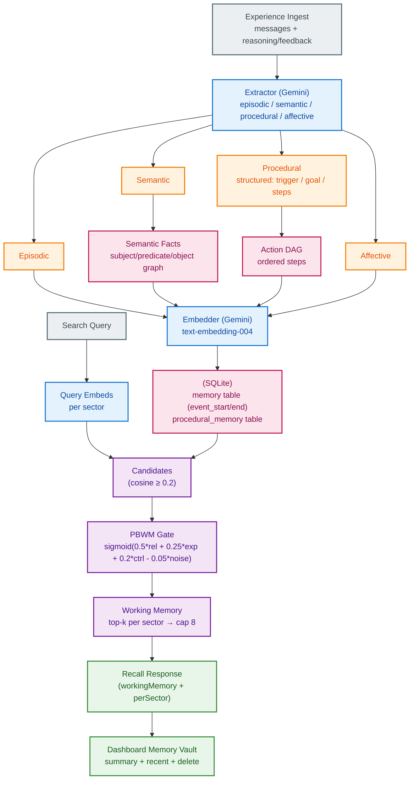

# Memory Service (Ekai)

Neuroscience-inspired, sectorized memory kernel. Runs as a standalone service (default port 4005) and is currently opt-in.

## Quickstart (standalone)

```bash
npm install -w memory
npm run build -w memory
npm start -w memory
```

Env (root `.env` or `memory/.env`):

- `GOOGLE_API_KEY` (required for Gemini extract/embeds)
- Optional: `GEMINI_EXTRACT_MODEL` (default `gemini-2.5-flash`)
- Optional: `GEMINI_EMBED_MODEL` (default `text-embedding-004`)
- Optional: `MEMORY_PORT` (default `4005`)
- Optional: `MEMORY_DB_PATH` (default `./memory.db`)
- Optional: `MEMORY_CORS_ORIGIN`

## API (v0)

- `POST /v1/ingest` — ingest an experience  
  Body:
  ```json
  {
  "messages": [
    { "role": "user", "content": "..." },
    { "role": "assistant", "content": "..." }
  ],
  "reasoning": "optional",
  "feedback": {
    "type": "success|failure",
    "value": 0
  },
  "metadata": {}
  }
  ```
  Requires at least one user message. `reasoning`, `feedback`, and `metadata` are optional and currently not used in extraction/scoring (feedback is not yet applied; retrieval_count drives expected_value).

- `POST /v1/search` — body `{ "query": "..." }` → returns `{ workingMemory, perSector }` with PBWM gating.

- `GET /v1/summary` — per-sector counts + recent items (includes procedural details).

- `DELETE /v1/memory/:id` — delete one; `DELETE /v1/memory` — delete all.

- `GET /health`

## Data model (SQLite)

- `memory` table for episodic / semantic / affective:  
  `id, sector, content, embedding, created_at, last_accessed, event_start, event_end`.
- `procedural_memory` table for structured procedures:  
  `trigger, goal, context, result, steps[], embedding, timestamps`.
- `retrieval_count` tracks how often a memory enters working memory; used in PBWM expected_value.
- `semantic_memory` (graph-lite facts): `subject, predicate, object, valid_from, valid_to, strength, embedding, metadata`.

## Semantic Consolidation

When ingesting semantic facts, the system applies consolidation logic using **semantic similarity** for predicate matching:

1. **Find existing facts**: Query all active facts for the same subject
2. **Semantic predicate matching**: Use embeddings to find predicates with ≥0.9 cosine similarity
   - "is co-founder of" ≈ "cofounded" ≈ "founded" → treated as same slot
3. **Consolidation action**:
   - **Merge**: Same object exists → strengthen it (increment `strength`)
   - **Supersede**: Different object for similar predicate → close old fact (`valid_to = now`), insert new
   - **Insert**: No matching predicate → insert new with `strength = 1.0`

This approach:
- Handles natural language variation in predicates (synonyms, paraphrases)
- Preserves history while avoiding duplicate facts
- Superseded facts remain queryable for temporal reasoning

## Retrieval

- Query is embedded per sector.
- Candidates with cosine `< 0.2` are dropped.
- PBWM-inspired gate (prefrontal–basal ganglia model) scores the rest:

  ```
  x = 0.5 * relevance + 0.25 * expected_value + 0.2 * control - 0.05 * noise
  gate_score = sigmoid(x)
  ```
- We use retrieval_count (log-normalized) for `expected_value` and keep `control = 0.5` for now; small Gaussian noise is applied.
- Candidates are sorted by `gate_score`, top-k per sector are kept, then merged and capped to a working-memory size of 8.

## Architecture (v0)



## Notes / Limitations

- Only Gemini provider is wired (provider abstraction is pending). OpenAI would need wiring.
